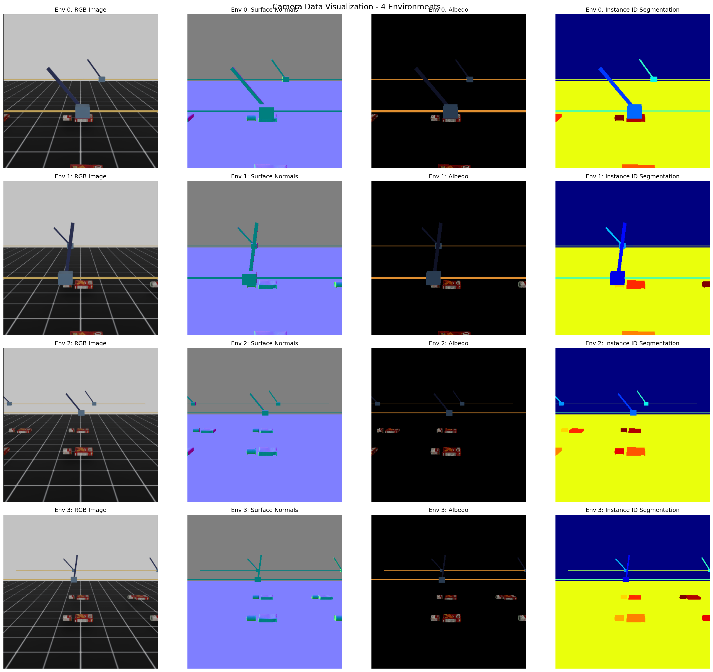

# G-Buffer Camera Example



## Running the Example

To run the G-Buffer Camera Example, execute the following command in your terminal:

```bash
python visualize_camera.py --enable_cameras
```

## G-Buffer Camera Overview

`GBufferCamera` (`source/isaaclab/isaaclab/sensors/camera/gbuffer_camera.py`) is derived from `TiledCamera` and extends its functionality by providing access to additional G-buffer data.

Currently only albedo data is supported, which is implemented using the `DiffuseAlbedo` annotator in Omniverse Isaac Sim (see [docs](https://docs.omniverse.nvidia.com/py/replicator/latest/source/extensions/omni.replicator.core/docs/API.html#diffusealbedo)).

### Configuration for G-Buffer Camera

Similar to `TiledCamera`, but with an additional parameter `gbuffer_data_types`.

```python
# In your scene config
camera: GBufferCameraCfg = GBufferCameraCfg(
    gbuffer_data_types=["albedo"],  # new parameter
    prim_path="{ENV_REGEX_NS}/Camera",
    offset=GBufferCameraCfg.OffsetCfg(pos=(-7.0, 0.0, 3.0), rot=(0.9945, 0.0, 0.1045, 0.0), convention="world"),
    data_types=["rgb", "normals", "instance_id_segmentation_fast"],
    spawn=sim_utils.PinholeCameraCfg(
        focal_length=24.0, focus_distance=400.0, horizontal_aperture=20.955, clipping_range=(0.1, 20.0)
    ),
    width=400,
    height=400,
    colorize_instance_id_segmentation=False,
)
```

### Additional Requirements for the Environment

Add this line to your environment config to turn off DLSS. Otherwise, the albedo buffer will have different shapes to the final RGB image, leading to errors.

```python
self.sim.render.antialiasing_mode = "DLAA"  # or "TAA"
```

### Accessing G-Buffer Data

```python
camera = env.scene["camera"]
camera_data = camera.data.output
# rgb_data = camera_data["rgb"].cpu().numpy()  # Shape: (num_envs, H, W, 3)
albedo_data = camera_data["gbuffer:albedo"].cpu().numpy()  # Shape: (num_envs, H, W, 3)
```
